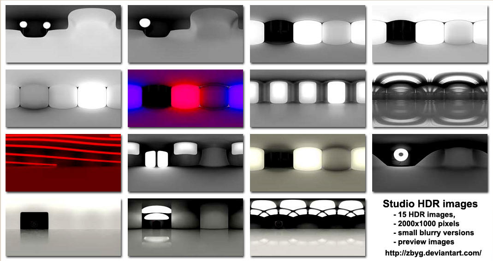

# PBRComposer
## Overview
In short, PBR Composer helps you to design and visualize a PBR Material efficiently. Adjusting parameters can be done by drag and drop. You can choose nodes from a palette (typically textures, colors and uv-coordinates) and connect it to the output node, which represents the PBR Material. A preview panel displays all changes instantly as well as the corresponding js-sourcecode. The resulting graph can be saved in JSON format. Images can be either placed per drag and drop or within the preview dialog. After dropping all images will be transformed into embedded data-urls, so there is no need to change dependencies as the javascript functions remain as they are. Different meshes and environment maps are available to see the material under different geometry and reflective light conditions: 4 basic and 15 studio images are included.

## Motivation
Due to the complexity of the PBR material (soo many combinations with soo much amazing effects) there is a need of having instant feedback reflecting your changes. Other than common editors using a bunch of parameters in confusing properties panels PBR composer focuses on your parameters - and you can nicly adjust them in a graphical way. Nodes can also be shared: that prevents redundancy sourcecode per concept. The goal is to make the user interface as efficient as possible. Special thanks to **Shader Editor** (http://victhorlopez.github.io/editor/) that inspired PBS Composer.
## Technical details
PBR Composer is a web application based on **dat.gui** (https://code.google.com/p/dat-gui/), **w2ui**(http://w2ui.com/web/), **litegraph.js** (https://github.com/jagenjo/litegraph.js), **Litegl.js** (https://github.com/jagenjo/litegl.js), **Font-awesome** (http://fortawesome.github.io/Font-Awesome/) and of course on **BABYLON.js** (https://www.babylonjs.com/). 
## Installation
PBR Composer ships with all dependencies in its 'src' directory. Just copy that directory in the document root of your web space and adjust permissions that your webserver can read the files. Point your browser to the URL of your webspace - that's it.
## Configuration
There are some few configuration files:
* **src/assets/textures/texture/list.txt:** a list of image names in that directory (newline seperated, path omitted: just use the filenames). The files in this list are read as file URLs (no data URLs) to achieve higher performance. Double click a TextureSample node to access them quickly. Please note: deleting and changing images can cause inconsistencies while loading.
* **src/assets/textures/cubemap/list.txt:** a list of *.hdr cubemap names in that directory (newline seperated, path omitted). This cubemap entries will be used when cycling the environment on the User Interface. Please note again: changing entries can lead to an inconsistent state.
* **src/graphs/list.txt:** a list of *.json graph names (newline seperated, path omitted) for quick access from the toolbar button of the User Interface. Note that graphs also can be dropped on the Graph Panel. One entry has to be in this list permanently: "emty_graph.json" is used to reset the graph. Usually this graph contains one node (the Output node) only but you can use any graph you'd like - just rename the file.
## Documentation
See [User Interface](doc/README.md)
## Demo
[V1.00 beta](http://johann.langhofer.net/PBRComposer)
