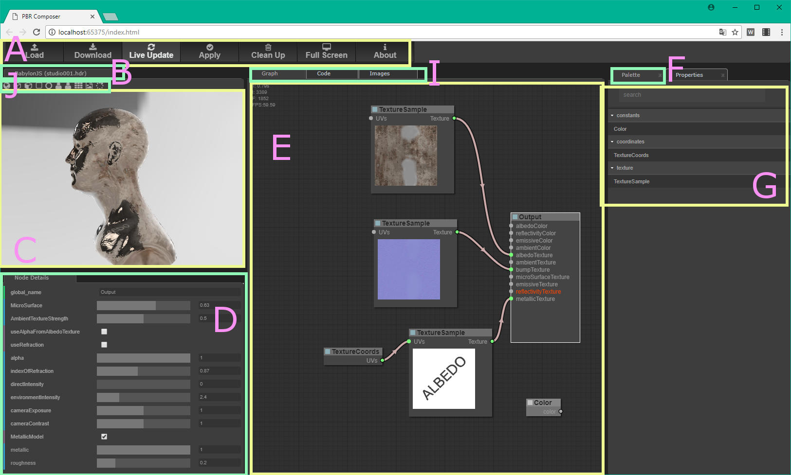

# user interface

## Button Bar (A)

### Load
Load graphs here or drag graphs into the Graph Panel (E).
### Download
Download the graph for later usage (graph doesn't contain sourcecode).
### LiveUpdate
When pressed (arrows spinning) all user actions were live evaluated and the sourcecode will be kept up-to-date.
### Apply
The Apply button forces an extra evaluation cyle to synchronize all components.
### CleanUp
Clears the entire graph to its initial state. A confirm message dialog will be shown before this action takes place.
### About
Shows the Aboutbox for further information.
