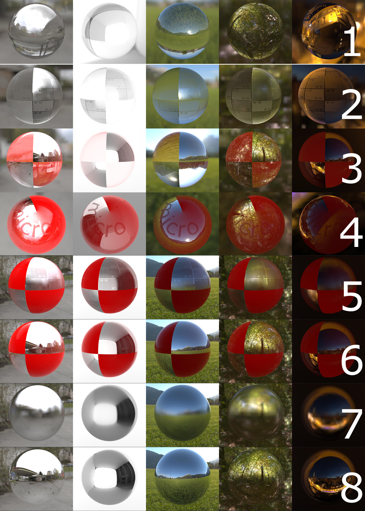
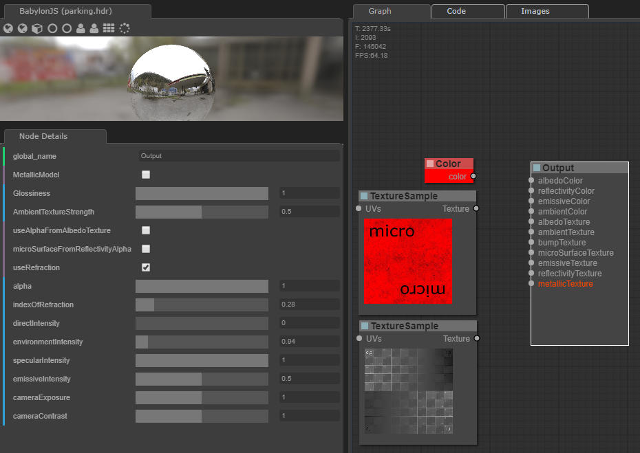
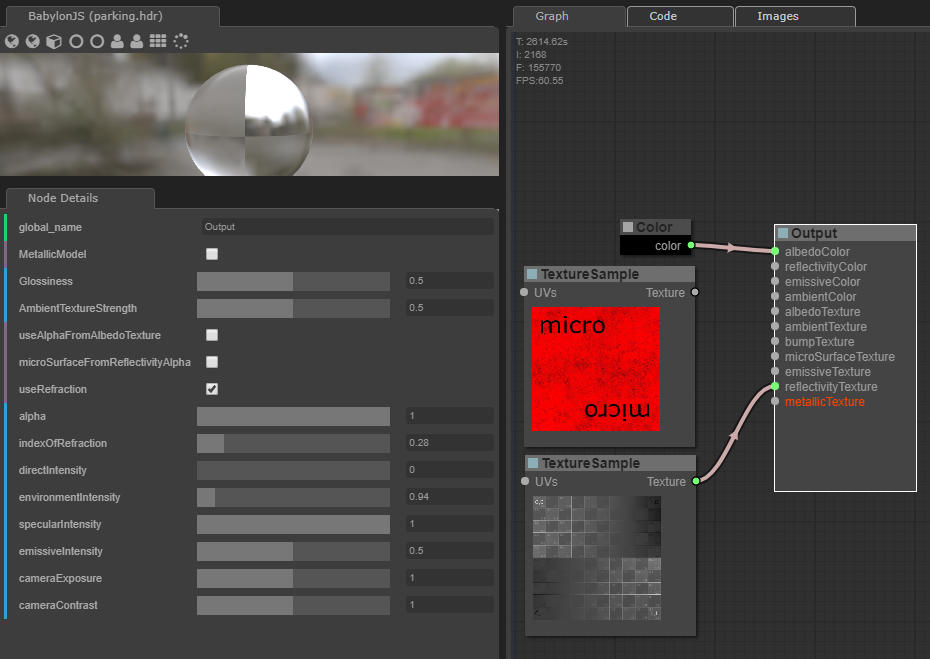
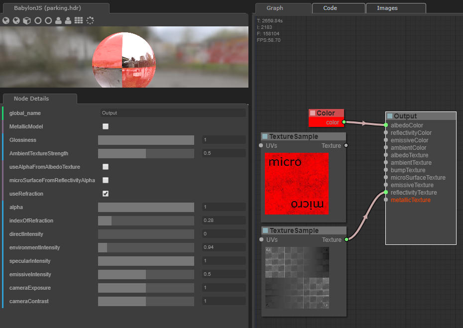
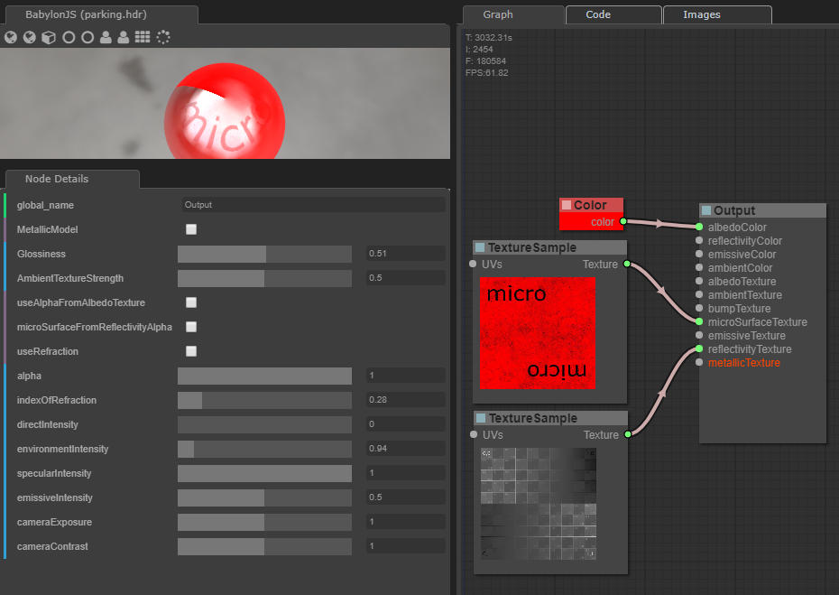
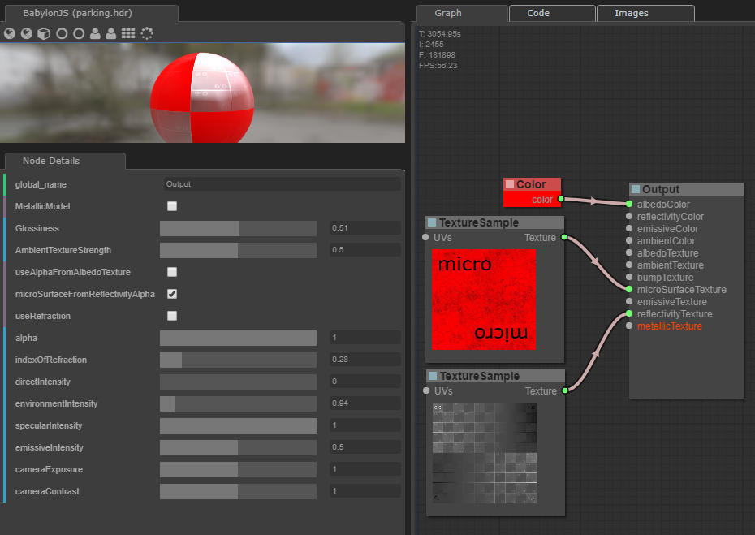
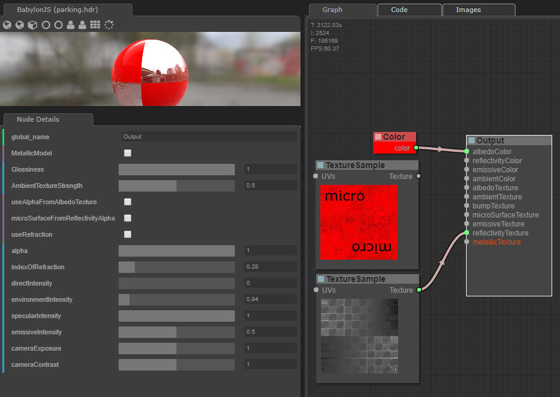
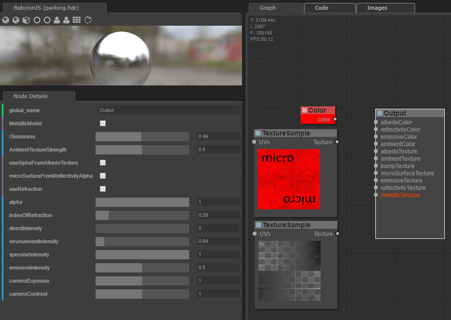
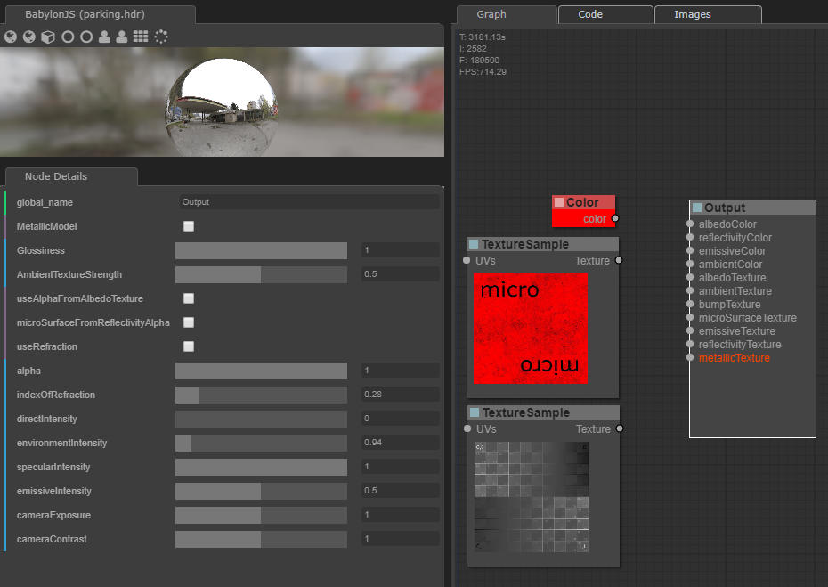

# examples glossy setup
The following images are some examples with only a few parameters set. Different enviroments are used (from left to right):
* parking.hdr
* studio003.hdr
* environment.hdr
* forest.hdr
* night.hdr

row|paramters|refraction
---|---------|----------
1||true
2||true
3||true
4||false
5||false
6||false
7||false
8||false
